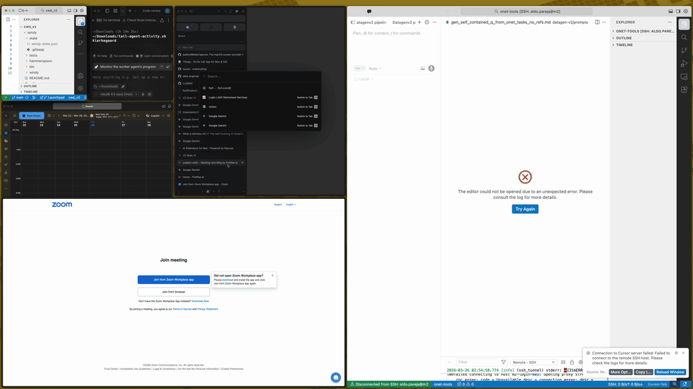

# Windy

Windy is a small macOS window workflow for yabai + Hammerspoon.

Windy helps you keep a space clean and deliberate. Reset the layout, split it into visible tiles, navigate them, and use Alt-Tab to promote the right window.

## Prerequisites

- macOS
- yabai installed and working
- Hammerspoon installed
- `hs` available in your shell
- Accessibility and automation permissions already granted to yabai and Hammerspoon

## Install

```sh
git clone <repo-url>
cd windy
./bin/windy install hammerspoon
```

Windy stores the repo path in your Hammerspoon config. If you move the repo later, run the install command again.

## Use

- `ctrl+alt+space`: start managing the current space
- `ctrl+alt+h`: split top/bottom
- `ctrl+alt+v`: split left/right
- `ctrl+alt+left/right/up/down`: move between visible tiles
- `ctrl+alt+d`: close the current tile into another tile
- `ctrl+alt+f`: stop managing the current space
- `opt+tab`: choose another window and commit the swap when you release `opt`

## Update

```sh
git pull
./bin/windy install hammerspoon
```
